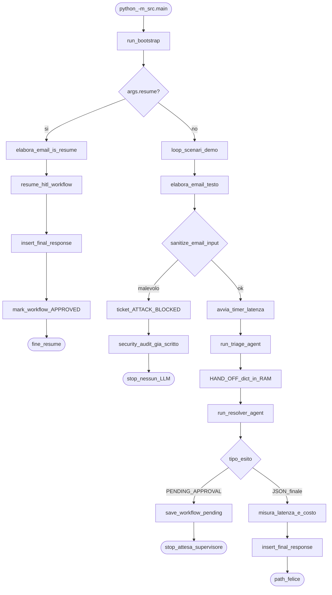
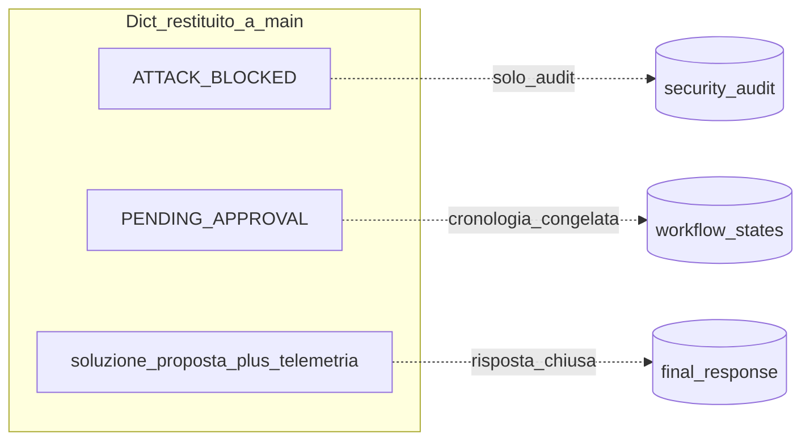

# 01 — Overview: flowchart end-to-end

Documento radice del flusso Autobahn Customer Care (progetto di studio).
Gli altri file in `docs/` approfondiscono i nodi più densi.

## Contesto in una frase

Un’email cliente entra da `python -m src.main` → bootstrap → pipeline deterministica `elabora_email` (guardrail → triage LLM → resolver ReAct) → esito su SQLite **oppure** blocco sicurezza **oppure** freeze HITL riprendibile con `--resume`.

## Mappa moduli (file → ruolo)

| Percorso | Ruolo |
|----------|--------|
| [`src/main.py`](../src/main.py) | CLI demo: scenari email e `--resume` |
| [`src/bootstrap.py`](../src/bootstrap.py) | `.env`, cartelle, `init_db`, warm indice policy |
| [`src/logic.py`](../src/logic.py) | Orchestratore + A1 Triage + A2 Resolver + HITL |
| [`src/guardrails.py`](../src/guardrails.py) | Sanitizzazione ingresso; ticket `ATTACK_BLOCKED` |
| [`src/input_guardrail.py`](../src/input_guardrail.py) | Scanner regex / vettori di attacco |
| [`src/tools/tools.py`](../src/tools/tools.py) | Tool callable: ordine, policy RAG, rimborso |
| [`src/rag.py`](../src/rag.py) | Chunking, `embed_texts`, ricerca semantica |
| [`src/policy_store.py`](../src/policy_store.py) | Persistenza embedding policy in SQLite |
| [`src/database.py`](../src/database.py) | Schema SQLite, CRUD, chiama seed |
| [`test/seed.py`](../test/seed.py) | Dati demo: ordini + sessione HITL seed |
| [`data/policy_supporto.txt`](../data/policy_supporto.txt) | Testo policy aziendale (fonte RAG) |

> **Nota didattica:** la pipeline è **lineare e deterministica** a livello di grafo (non c’è un router LLM che sceglie “quale agente chiamare”). L’unica “scelta” dell’LLM è *dentro* A2 (quali tool chiamare e quando chiudere col JSON).

## Comandi di ingresso

```bash
python -m src.main
# → run_bootstrap() poi loop sugli scenari in _SCENARI_DEMO

python -m src.main --resume SESS-TEST-RESUME-01
# → run_bootstrap() poi elabora_email("", is_resume=True, id_sessione=...)
```

> **Nota didattica:** il seed in [`test/seed.py`](../test/seed.py) fa `INSERT OR REPLACE` su `SESS-TEST-RESUME-01` a ogni `init_db`, così il resume demo resta ripetibile anche dopo un run precedente che aveva segnato la sessione `APPROVED`.

## Flowchart globale



## I tre esiti possibili di `elabora_email` (path email)



| Esito | Chiave tipica | LLM? | Persistenza tipica |
|-------|---------------|------|--------------------|
| Blocco sicurezza | `stato_ticket=ATTACK_BLOCKED` | No | `security_audit` |
| Freeze HITL | `stato_workflow=PENDING_APPROVAL` | Sì (fino al breakpoint) | `workflow_states` — **no** `final_response` |
| Path felice | `soluzione_proposta`, `id_risposta`, … | Sì | `final_response` |

In demo, su `ATTACK_BLOCKED` [`src/main.py`](../src/main.py) stampa anche:

```text
[DEMO] Scenario bloccato dal guardrail, nessun LLM
```

## Scenari demo (concetto)

Allineati agli ordini in seed (`ORD-999-OK`, `ORD-101-LOST`, injection, `ORD-404-REFUND-HIGH`, `ORD-302-REFUND-LOW`):

1. Ordine OK — path felice “semplice”
2. Ordine smarrito — A2 usa tool + policy
3. Prompt injection — stop al guardrail
4. Rimborso alto (250€) — freeze HITL se A2 chiama `issue_refund`
5. Rimborso sotto soglia (35€) — path completo fino a `final_response` se A2 chiama `issue_refund` (nessun freeze)

> **Nota didattica:** gli scenari 4 e 5 *live* dipendono dal fatto che l’LLM decida di chiamare `issue_refund` (4 → `PENDING_APPROVAL`, 5 → rimborso automatico). Il resume seed (`SESS-TEST-RESUME-01`) invece è **deterministico**: la cronologia finta ha già il `tool_calls` pendente sul ramo alto.

## Dove approfondire

- Bootstrap e seed → [02-bootstrap-e-seed.md](02-bootstrap-e-seed.md)
- Guardrail → [03-guardrail.md](03-guardrail.md)
- A1 / A2 → [04-triage-e-resolver.md](04-triage-e-resolver.md)
- RAG → [05-rag-embeddings.md](05-rag-embeddings.md)
- HITL → [06-hitl-resume.md](06-hitl-resume.md)
- DB e telemetria → [07-persistenza-telemetria.md](07-persistenza-telemetria.md)

## Approfondisci

1. Disegna a mano i tre esiti e indica, per ciascuno, se paghi token OpenAI e su quale tabella scrivi.
2. Perché il resume **non** rilegge l’email originale del cliente?
3. Quale pezzo del sistema è “agentico” e quale è codice Python fisso?
