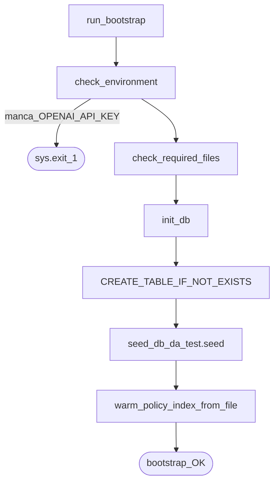
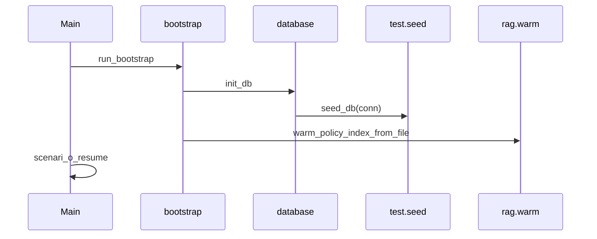

# 02 — Bootstrap e seed

All’avvio di ogni demo (`python -m src.main` o `--resume`) la prima operazione è sempre `run_bootstrap()` in [`src/bootstrap.py`](../src/bootstrap.py).

## Perché esiste

Senza bootstrap non hai: chiave API, cartelle `data/` / log, schema SQLite, righe ordine di test, indice vettoriale delle policy. Gli agenti LLM non “inventano” i fatti: li leggono da DB e da RAG.

## Flowchart



## Passi numerati

1. **`check_environment`** — legge config (`.env` via `src/config.py`). Se manca `OPENAI_API_KEY` → exit critico.
2. **`check_required_files`** — `ensure_directories_exist()`, cartella log, warning se manca `policy_supporto.txt`.
3. **`init_db`** ([`src/database.py`](../src/database.py)) — crea tabelle se assenti, poi chiama `seed_db`.
4. **`seed_db`** ([`test/seed.py`](../test/seed.py)) — popola `ordini` e la sessione HITL demo.
5. **`warm_policy_index`** — se il file policy c’è, allinea l’indice embedding SQLite (vedi [05-rag-embeddings.md](05-rag-embeddings.md)).

> **Nota didattica:** il seed **non** sta più dentro `database.py`: è fuori da `src` in `test/seed.py`, ma viene ancora invocato da `init_db`. Separazione “codice di prodotto” vs “dati di prova”.

## Cosa inserisce il seed

### Tabella `ordini`

| id_ordine | importo | Uso tipico in demo |
|-----------|---------|-------------------|
| `ORD-999-OK` | 45.50 | Scenario ordine spedito |
| `ORD-101-LOST` | 89.90 | Scenario smarrito + tool |
| `ORD-302-REFUND-LOW` | 35.00 | Rimborso sotto soglia HITL (≤ 100€) |
| `ORD-404-REFUND-HIGH` | 250.00 | Rimborso sopra soglia / freeze |

`INSERT OR IGNORE`: rieseguire il bootstrap non duplica le PK.

### Tabella `workflow_states` (resume demo)

- `id_sessione = SESS-TEST-RESUME-01`
- `stato_workflow = PENDING_APPROVAL`
- `messaggi_serializzati` = JSON con assistant + `tool_calls` di `issue_refund` su `ORD-404-REFUND-HIGH`, **senza** messaggio `role=tool` (stato esatto del breakpoint)

`INSERT OR REPLACE`: se la riga esisteva già (anche `APPROVED` dopo un resume), viene riallineata al contratto resume.

> **Nota didattica:** lo stato “dopo assistant con tool_calls, prima dell’observation” è il cuore del HITL. Se serializzassi anche l’observation, il resume non saprebbe più *cosa* doveva ancora eseguire.

## Seed standalone

```bash
python -m test.seed
```

Riapplica solo `seed_db` su DB già esistente (import lazy di `get_db_connection` per evitare cicli).

## Collegamento al resto



## Approfondisci

1. Cosa succede se cancelli solo la riga `SESS-TEST-RESUME-01` e rilanci `init_db`?
2. Perché `ORD-302-REFUND-LOW` è nello seed **e** nello scenario 5 di `main`, mentre `SESS-TEST-RESUME-01` riguarda un altro ordine sopra soglia?
3. Dove vive `policy_hash` dopo il warm? (spoiler: `policy_index_meta`)
