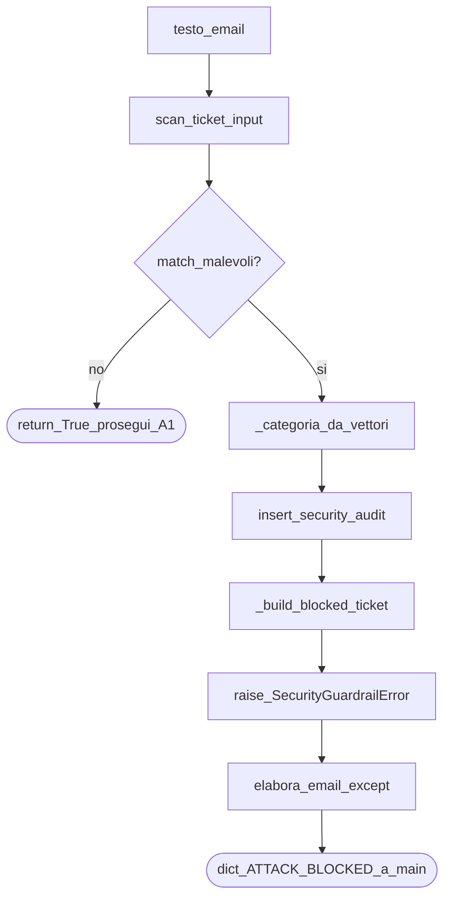

# 03 — Guardrail di ingresso

Il guardrail è il **primo** passo della pipeline email (dopo il bootstrap). È deterministico: **nessuna chiamata LLM**.

File chiave:

- [`src/guardrails.py`](../src/guardrails.py) — orchestrazione sanitizzazione + ticket + raise
- [`src/input_guardrail.py`](../src/input_guardrail.py) — scan regex / vettori di attacco
- [`src/errors.py`](../src/errors.py) — `SecurityGuardrailError` con payload `ticket`
- [`src/logic.py`](../src/logic.py) — `elabora_email` cattura l’eccezione e restituisce il dict

## Flowchart



## Passi numerati

1. `sanitize_email_input(testo)` chiama lo scanner.
2. Se **sicuro** → `True`; l’orchestratore avvia il timer latenza e A1.
3. Se **malevolo**:
   - sceglie una sola `categoria_attacco` (priorità: tool hijack > policy override > …);
   - scrive su `security_audit`;
   - costruisce un ticket con `stato_ticket=ATTACK_BLOCKED`, `priorita=CRITICAL`, excerpt, `id_audit`;
   - alza `SecurityGuardrailError(ticket=...)`.
4. `elabora_email` **non** propaga l’eccezione a `main`: la cattura, stampa e restituisce `exc.ticket`.

> **Nota didattica:** “soft interrupt”. Il main tratta il risultato come un dict qualunque; non deve conoscere il contratto delle eccezioni. Il print demo `[DEMO] Scenario bloccato dal guardrail, nessun LLM` rende esplicito che **non** si è pagato Triage/Resolver.

## Cosa *non* succede sul blocco

- Nessun `run_triage_agent` / `run_resolver_agent`
- Nessun `insert_final_response`
- Nessuna telemetria token/latenza di pipeline (il timer parte **dopo** il guardrail ok)

> **Nota didattica:** se misurassi la latenza anche sui ticket bloccati, confrontaresti “tempo regex” con “tempo LLM”: numeri inutili e fuorvianti nel PDF di corso.

## Vettori tipici (studio)

Lo scanner riconosce famiglie come:

- injection diretta (“ignora le istruzioni…”)
- policy override
- tool hijack (`isolate_account`, ecc.)
- role override / log suppression

Lo scenario 3 in `main` è costruito apposta per matchare pattern di injection + hijack.

## Collegamento a main

```text
SCENARIO: 3 — Prompt injection ...
[PIPELINE] Interrotta da guardrail | stato='ATTACK_BLOCKED' | ...
[DEMO] Scenario bloccato dal guardrail, nessun LLM
[DEMO] Risultato finale: { ... ticket JSON ... }
```

## Approfondisci

1. Perché `categoria_attacco` è una sola colonna se lo scan può trovare più match?
2. Differenza tra `result.severity` (tecnica dello scan) e `priorita` del ticket (business)?
3. Dove finirebbe un false positive: stesso percorso di un attacco reale?
