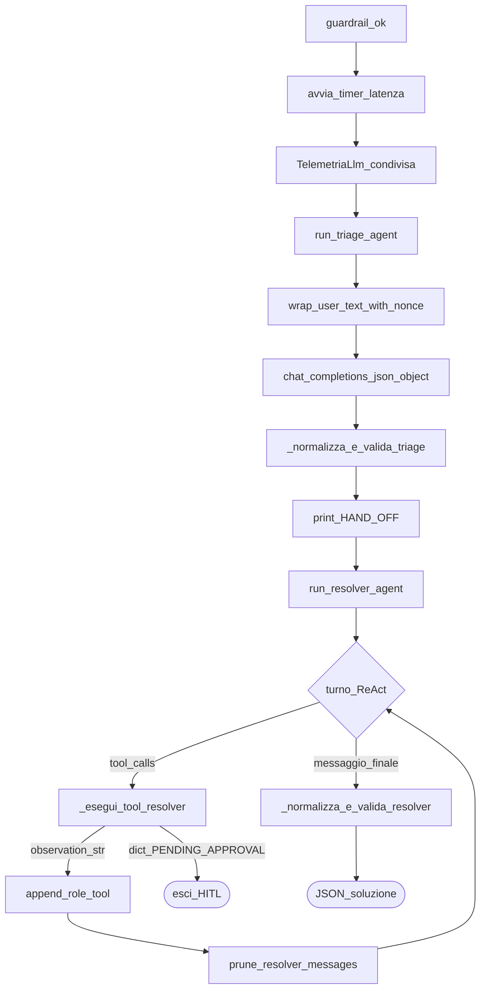
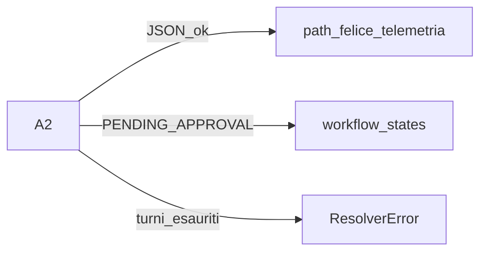

# 04 — Triage (A1) e Resolver (A2)

Dopo il guardrail ok, la pipeline chiama due agenti LLM in sequenza fissa. Entrambi vivono in [`src/logic.py`](../src/logic.py).

## Ruoli

| Agente | Funzione | Tools? | Output |
|--------|----------|--------|--------|
| **A1 Triage** | Classifica l’email (lingua, riassunto, id ordine sospetto, email) | No | JSON validato |
| **A2 Resolver** | Usa fatti (DB/policy) e propone soluzione | Sì (ReAct) | JSON finale **oppure** freeze HITL |

> **Nota didattica:** A1 **non** legge SQLite. Non deve “risolvere” il ticket: prepara un hand-off strutturato per A2. Separare triage e risoluzione riduce hallucination di azioni premature.

## Flowchart pipeline post-guardrail

## A1 — dettagli

1. System prompt triage (solo classificazione).
2. User text wrappato con **nonce** di sicurezza (`wrap_user_text_with_nonce`): delimitatori che aiutano a isolare il contenuto “dato” dalle istruzioni di sistema.
3. Una chiamata LLM con `response_format` JSON object.
4. Estrazione/validazione campi; in caso di fallimento → `TriageError`.
5. Accumulo `usage` in `TelemetriaLlm`.

Hand-off: **solo in RAM** + print `[HAND-OFF] {...}`. Non viene scritto su file o tabella dedicata.

> **Nota didattica:** hand-off volatile = contratto didattico STEP 3. Se volessi riprendere un triage senza ricalcolare, dovresti persistere quel JSON; oggi non serve perché la pipeline è one-shot per email.

## A2 — loop ReAct

1. Messaggi iniziali: system resolver + user con JSON triage + email (di nuovo con nonce).
2. Ogni turno: `_chiama_llm_resolver` (tools OpenAI abilitati).
3. Se la risposta ha `tool_calls`:
   - append messaggio assistant (con i tool_calls);
   - per ogni call → `_esegui_tool_resolver` (intercetta HITL su `issue_refund`);
   - se freeze → return dict `PENDING_APPROVAL` **senza** observation tool;
   - altrimenti append `role=tool` con observation.
4. `prune_resolver_messages`: tiene system + inizio + coda limitata (costo contesto).
5. Quando l’assistant risponde senza tool (o con JSON finale): valida e restituisce.

Tool disponibili (vedi [`src/tools/tools.py`](../src/tools/tools.py)):

- `get_order_status` — SELECT su `ordini`
- `get_support_policy` — RAG semantica (vedi [05](05-rag-embeddings.md))
- `issue_refund` — rimborso simulato; può essere intercettato (vedi [06](06-hitl-resume.md))

> **Nota didattica:** il system prompt dice di chiamare `issue_refund` solo dopo status + policy. È **guida** all’LLM, non un hard lock. Il hard lock sul denaro alto è nel codice (`importo > SOGLIA_RIMBORSO_EUR`), non nella buona volontà del modello.

## Validazione JSON

Sia A1 sia A2 passano da helper che:

- estraggono l’oggetto JSON dal testo (anche se c’è rumore intorno, con cautela sui nonce);
- normalizzano tipi/stringhe;
- verificano campi obbligatori e enum (es. priorità).

Fallimenti → eccezioni tipizzate (`TriageError` / `ResolverError`), non “dict mezzo vuoti” silenziosi.

## Collegamento agli esiti

## Approfondisci

1. Perché A1 e A2 condividono la stessa istanza `TelemetriaLlm`?
2. Cosa rischieresti se A2 potesse chiamare tool *prima* del guardrail?
3. Apri un log di run e conta quante volte vedi `[TOOL]` vs chiamate chat: relazionalo al loop ReAct.
