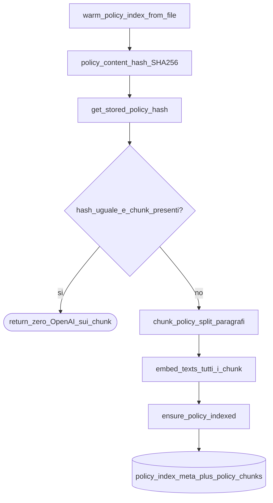
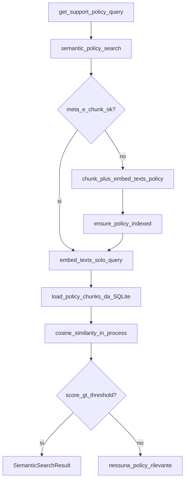

# 05 — RAG e embeddings (policy)

La policy aziendale vive in testo piano [`data/policy_supporto.txt`](../data/policy_supporto.txt).
A2 non legge l’intero file a ogni turno: usa ricerca semantica su chunk già indicizzati in SQLite.

Moduli:

- [`src/rag.py`](../src/rag.py) — chunking, `embed_texts`, search, warm
- [`src/policy_store.py`](../src/policy_store.py) — hash file, BLOB embedding, load/save
- Tool [`get_support_policy`](../src/tools/tools.py) — facciata usata dall’agente

## Idea chiave

Due usi distinti della **stessa** funzione `embed_texts(client, texts)`:

| Caso | `texts` | Quando |
|------|---------|--------|
| Indice policy | lista di **tutti** i chunk del file | bootstrap / rebuild se hash stale o indice assente |
| Query tool | lista con **una** stringa (la query) | **ogni** `get_support_policy` |

> **Nota didattica:** non confondere “rigenero gli embedding della policy” con “embeddo la domanda”. Il primo è costoso e raro; il secondo è obbligatorio a ogni ricerca (altrimenti non hai un vettore query per la cosine).

## Flowchart: warm all’avvio



## Flowchart: tool `get_support_policy`



Soglia default: `DEFAULT_THRESHOLD = 0.38` in `rag.py`.

## Persistenza vettoriale

Tabelle (create in `database.py`):

- **`policy_index_meta`** — una riga (`id=1`): `policy_hash`, `source_path`
- **`policy_chunks`** — N righe: testo, `embedding` BLOB (`float32`), stesso `policy_hash`

Conversione: `embedding_to_blob` / `blob_to_embedding` in `policy_store.py` (numpy).

> **Nota didattica:** salvare `float32` riduce spazio su disco senza distruggere la qualità tipica della cosine su embedding OpenAI di questa scala didattica.

## Gap da conoscere (studio)

`warm_policy_index_from_file` confronta **hash del file** vs meta.

`semantic_policy_search`, nel path tool, oggi controlla soprattutto “meta presente + chunk caricabili”. Se modifichi `policy_supporto.txt` **a runtime** senza ri-warm, potresti continuare a cercare sull’indice vecchio finché non ripassi dal bootstrap/warm.

> **Nota didattica:** per una demo one-shot va bene. In produzione vorresti lo stesso check hash anche nel path search (o un watcher sul file).

## Collegamento agli agenti

A2 chiama `get_support_policy(query="...")` → observation testuale con prefisso:

```text
[RAG semantica | score=0.xxx]
...chunk...
```

Lo score aiuta l’operatore (e il modello) a capire quanto il match è affidabile; sotto soglia il tool restituisce un messaggio di “nessun match” invece di inventare regole.

## Approfondisci

1. Conta quante chiamate embeddings fai: 1 warm + N tool policy in un ticket smarrito.
2. Perché lo split è su `\n\n` (paragraph chunking) e non su frasi isolate?
3. Cosa restituisce il tool se la query è stringa vuota? (hint: validazione in `tools.py` prima della RAG)
