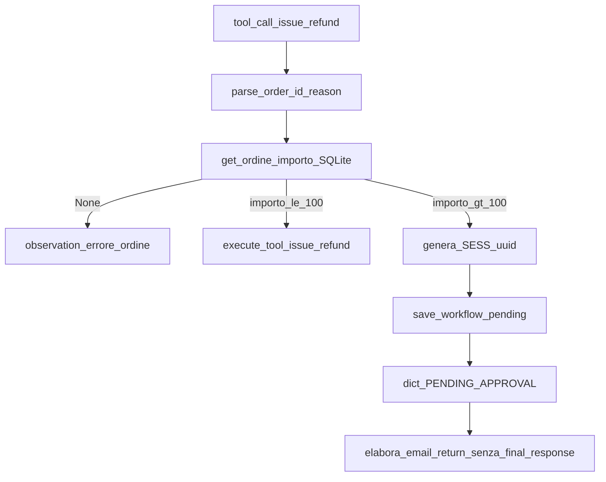
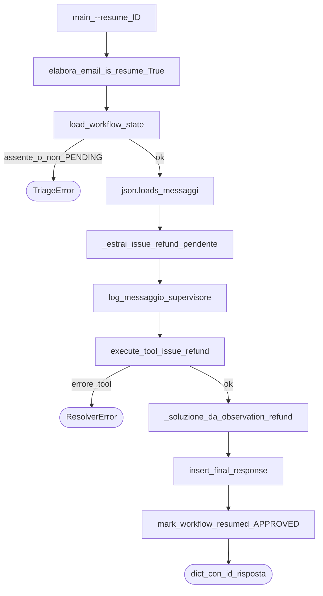

# 06 — HITL e resume

HITL = *Human In The Loop*: oltre una soglia di denaro il sistema **non** completa da solo il rimborso; congela lo stato e aspetta un’approvazione (nella demo: simulata da CLI).

Costanti / pezzi chiave:

- `SOGLIA_RIMBORSO_EUR = 100.0` in [`src/logic.py`](../src/logic.py) (allineata a `policy_supporto.txt`)
- Intercettazione in `_esegui_tool_resolver`
- Persistenza `save_workflow_pending` / `load_workflow_state` / `mark_workflow_resumed` in [`src/database.py`](../src/database.py)
- CLI: `python -m src.main --resume <ID>`

In [`src/main.py`](../src/main.py), lo **scenario 4** (250€, `ORD-404-REFUND-HIGH`) e lo **scenario 5** (35€, `ORD-302-REFUND-LOW`) sono le demo live dei rami `importo_gt_100` e `importo_le_100` del flowchart sotto, se A2 invoca `issue_refund`.

## Flowchart freeze (durante A2)



> **Nota didattica:** la soglia usa l’importo **dal DB**, non quello “ricordato” dal modello. Altrimenti un LLM confuso potrebbe far passare un rimborso da 250€ come se fosse 50€.

## Cosa viene salvato al freeze

Stato esatto del breakpoint:

1. Lista `messages` del Resolver **dopo** aver appendato l’assistant con `tool_calls`
2. **Prima** di qualsiasi `role=tool` per quel `issue_refund`
3. `email_cliente` dall’hand-off A1
4. `id_ordine` (FK verso `ordini`, altrimenti NULL)
5. `stato_workflow = PENDING_APPROVAL`
6. `id_sessione` tipo `SESS-` + hex uuid (stampato a terminale)

Messaggio utente tipico nel dict:

> Workflow congelato: Richiesta di rimborso in attesa di approvazione da parte di un supervisore.

Priorità: `Critical`.

> **Nota didattica:** i token già spesi fino al breakpoint restano in `TelemetriaLlm` in RAM ma **non** vengono scritti su `final_response`. Il ticket non è chiuso.

## Flowchart resume



Implementazione attuale del resume (post-approvazione):

- **Nessun** nuovo turno LLM
- Solo `issue_refund` deterministico + costruzione testo soluzione + INSERT
- Telemetria token tipicamente a 0 sul path resume

> **Nota didattica:** in un design “riprendi il loop ReAct” rifaresti 1–2 call LLM con la cronologia. Qui, per consegna STEP 5 semplificata e ripetibile, dopo l’ok del supervisore si chiude senza riesporre il modello a tool arbitrari.

## Seed vs freeze live

| Origine `id_sessione` | Come nasce |
|-----------------------|------------|
| `SESS-TEST-RESUME-01` | Seed in [`test/seed.py`](../test/seed.py) a ogni `init_db` |
| `SESS-<uuid>` | Generato al freeze reale su rimborso > 100€ |

Entrambe devono avere messaggi con `issue_refund` pendente coerente con un ordine esistente.

## Collegamento a main

```bash
python -m src.main --resume SESS-TEST-RESUME-01
```

Salta Guardrail, Triage e nuova email: `elabora_email("", is_resume=True, id_sessione=...)`.

## Approfondisci

1. Perché al freeze **non** si appende l’observation del tool?
2. Cosa succede se rilanci `--resume` sulla stessa sessione dopo `APPROVED` (prima di un nuovo seed)?
3. Confronta rimborso 35€ vs 250€: stesso tool call, due percorsi di codice.
