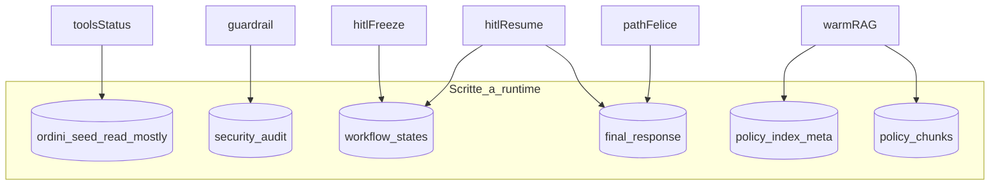

# 07 — Persistenza e telemetria

SQLite unico: [`data/customer_db.db`](../data/customer_db.db) (path da [`src/paths.py`](../src/paths.py)).
Schema e helper in [`src/database.py`](../src/database.py); formule costo in [`src/logic.py`](../src/logic.py).

## Tabelle (ruolo)

| Tabella | Quando si scrive | Quando si legge |
|---------|------------------|-----------------|
| `ordini` | seed | tool status, importo HITL, FK |
| `security_audit` | guardrail blocco | audit / demo |
| `workflow_states` | freeze HITL; seed resume; mark APPROVED | `--resume` |
| `final_response` | path felice e resume ok | storico risposte |
| `policy_*` | warm / rebuild indice | ogni search RAG |

> **Nota didattica:** non tutte le uscite di `elabora_email` toccano `final_response`. Blocco e freeze sono stati intermedi o di sicurezza: scrivere lì una “risposta chiusa” falserebbe il significato della tabella.

## Telemetria path felice

Dopo guardrail ok:

1. `t0 = avvia_timer_latenza()`
2. Stessa `TelemetriaLlm` accumula `usage` di A1 + turni A2
3. Prima dell’INSERT: `latenza = misura_latenza_secondi(t0)`, `costo = telemetria.costo_calcolato()`
4. `insert_final_response(...)` con token, costo, latenza, testo, priorità, email, ordine

Coefficienti didattici (non listino reale OpenAI):

- `COSTO_PER_TOKEN_IN = 0.000005`
- `COSTO_PER_TOKEN_OUT = 0.000015`

> **Nota didattica:** costi “PDF” permettono di confrontare run tra studenti senza dipendere dal prezzo del giorno sul modello.

## Mapping colonne `final_response` ← fonti

| Colonna | Fonte |
|---------|--------|
| `id_ordine` | JSON A2 (NULL se assente / non in FK) |
| `email_cliente` | hand-off A1 |
| `risposta_generata` | `soluzione_proposta` |
| `priorita_ticket` | `priorita` A2 (o Critical al resume HITL) |
| `token_input` / `token_output` | telemetria accumulata |
| `costo_calcolato` | formula sopra |
| `latenza_secondi` | wall-clock post-guardrail → pre-INSERT |

Al resume HITL: stessi campi, ma tipicamente token a 0 e latenza solo del lavoro post-approvazione (`issue_refund` + INSERT).

## Cosa non persistere (riepilogo)

| Situazione | Non scrivere su |
|------------|-----------------|
| `ATTACK_BLOCKED` | `final_response` |
| `PENDING_APPROVAL` | `final_response` (sì su `workflow_states`) |
| Token del freeze | colonne telemetria di `final_response` fino al resume |

## FK e robustezza

`workflow_states.id_ordine` e `final_response.id_ordine` referenziano `ordini`.
Helper di save possono azzerare a `NULL` un id non presente, evitando IntegrityError su demo sporche.

`PRAGMA foreign_keys = ON` nella connessione (`get_db_connection`).

## Approfondisci

1. Apri il DB dopo uno scenario injection: quante righe nuove in `security_audit` vs `final_response`?
2. Dopo un freeze live, trova `id_sessione` nel print e ispeziona `messaggi_serializzati` (JSON): manca il `role=tool`?
3. Perché misurare la latenza *prima* dell’INSERT e non dopo?
